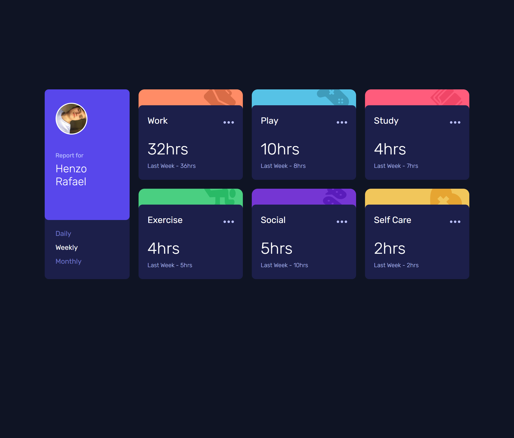

# Time-Tracking - FrontEndMentor 

> Time-tracking challenge

## Training

Projeto construido em desafio do FrontEndMentor - https://www.frontendmentor.io/challenges/time-tracking-dashboard-UIQ7167Jw

Treinando HTML, CSS (FlexBox, Grid Layout, Animations, etc) e JavaScript (rendering cards)

[Clique aqui para acessar](https://henzorafael.github.io/time-tracking)

## 🛠 Tecnologias 

- HTML
- CSS
- JavaScript
- Git e Github

## ✉ Contato

henzotvn@hotmail.com